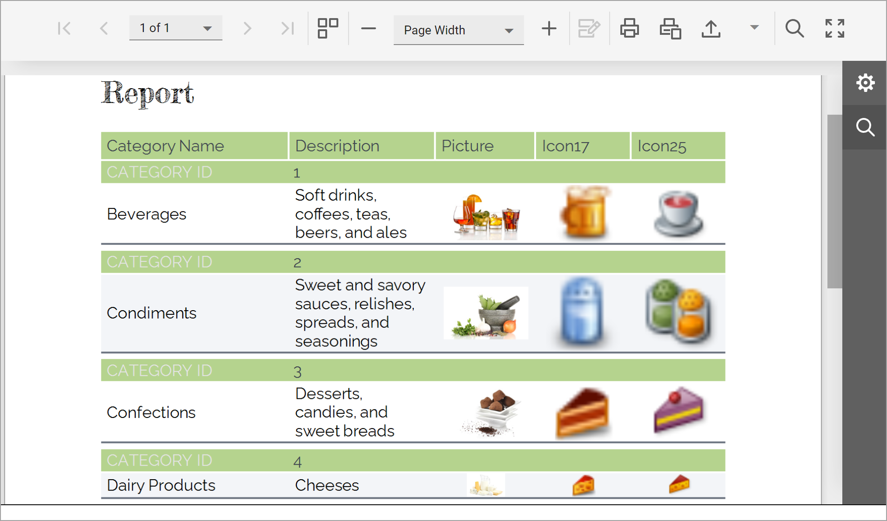

# Reporting for ASP.NET Core — Detect and Load Custom Fonts with Ease (DXFontRepository)

The following example detects and loads custom fonts used within a report. The application obtains a list of all fonts used in the report and loads them from the [Google Fonts](https://fonts.google.com/) resource, when available. Loaded fonts are added to the [DXFontRepository](https://docs.devexpress.com/CoreLibraries/404255/devexpress-drawing-library/use-font-repository-to-add-custom-fonts) automatically and made available without additional installation requirements.



>[!Note]
> Google Fonts are open-source, but be sure to read the associated license agreement to determine usage rights for your particular use case.

## Files to Review

* [FontCollectorService.cs](./CS/Services/FontCollectorService.cs)
* [HomeController.cs](./CS/Controllers/HomeController.cs)

## Build a Docker Image

### Visual Studio

You can run the app on supported Windows platforms, Windows Subsystem for Linux or Docker. Select a platform from the debug drop-down in the toolbar, and start debugging the app.

### CLI

Run the application from the dotnet CLI on Windows, Linux and MacOS with the dotnet run command. To run the Docker container from the command line, build the Docker image. You should pass the DevExpress NuGet source URL as a secret to restore NuGet packages.

#### Windows

```console
set DX_NUGET=https://nuget.devexpress.com/some-nuget-token/api 

docker build -t reporting-app --secret id=dxnuget,env=DX_NUGET .

docker run -p 8080:80 reporting-app:latest
```

#### Linux
 
```console
export DX_NUGET=https://nuget.devexpress.com/some-nuget-token/api 

DOCKER_BUILDKIT=1 docker build -t reporting-app --secret id=dxnuget,env=DX_NUGET . 

docker run -p 8080:80 reporting-app:latest 
```
 

The application page is available at the following URL: http://localhost:8080/.