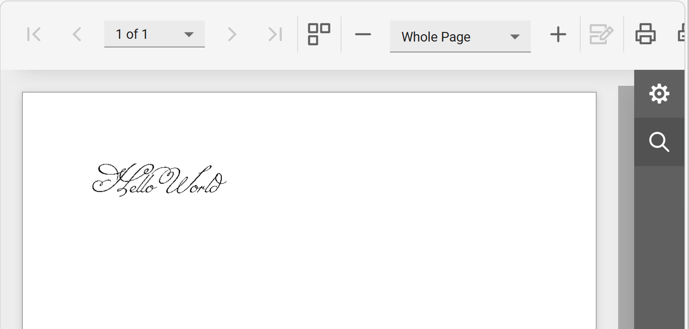

<!-- default badges list -->

[](https://supportcenter.devexpress.com/ticket/details/T1225208)
[](https://docs.devexpress.com/GeneralInformation/403183)
[](#does-this-example-address-your-development-requirementsobjectives)
<!-- default badges end -->
# Reporting for ASP.NET Core — Detect and Load Custom Fonts with Ease (DXFontRepository)

Loaded fonts are added to the [DXFontRepository](https://docs.devexpress.com/CoreLibraries/404255/devexpress-drawing-library/use-font-repository-to-add-custom-fonts) automatically and made available without additional installation requirements.



>[!Note]
> Be sure to read the associated font license agreement to determine usage rights for your particular use case.


## Build a Docker Image

### Obtain Your Personal DevExpress License Key

Building a project within a dockerized environment cannot obtain the host's key automatically - which is usually supplied as a build-time secret. Refer to [License Key for DevExpress .NET Products](https://docs.devexpress.com/GeneralInformation/405494/trial-register/set-up-your-dev-express-license-key).

### Visual Studio

You can run the app on supported Windows platforms, Windows Subsystem for Linux or Docker. Select a platform from the debug drop-down in the toolbar, and start debugging the app.

### CLI

Run the application from the dotnet CLI on Windows, Linux and MacOS with the dotnet run command. To run the Docker container from the command line, build the Docker image.

#### Windows

```console
cd DocumentViewerApp

docker build -t reporting-app --secret "id=dxLicense,src=%APPDATA%\DevExpress\DevExpress_License.txt" .

docker run -p 8080:80 reporting-app:latest
```

#### Linux
 
```console
cd DocumentViewerApp

docker build -t reporting-app --secret "id=dxLicense,src=$HOME/.config/DevExpress/DevExpress_License.txt" .

docker run -p 8080:80 reporting-app:latest 
```
 

The application page is available at the following URL: http://localhost:8080/.
<!-- feedback -->
## Does This Example Address Your Development Requirements/Objectives?

[](https://www.devexpress.com/support/examples/survey.xml?utm_source=github&utm_campaign=reporting-asp-net-core-custom-fonts&~~~was_helpful=yes) [](https://www.devexpress.com/support/examples/survey.xml?utm_source=github&utm_campaign=reporting-asp-net-core-custom-fonts&~~~was_helpful=no)

(you will be redirected to DevExpress.com to submit your response)
<!-- feedback end -->
